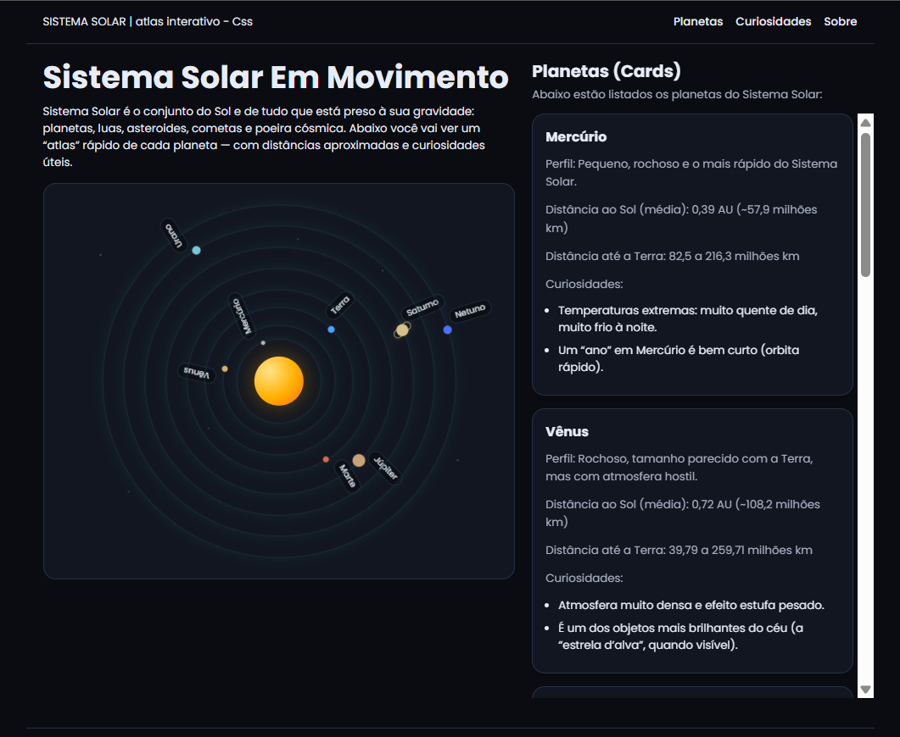
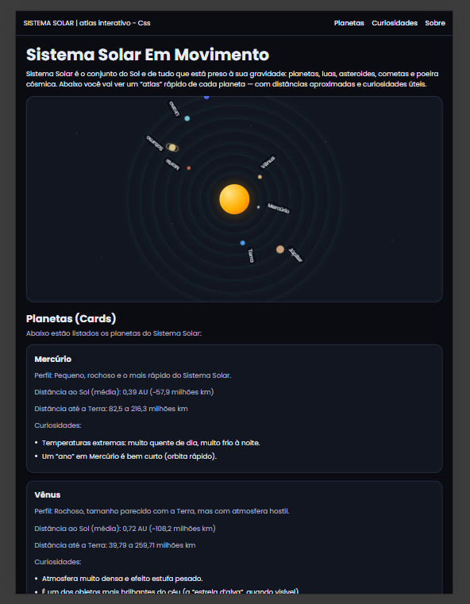
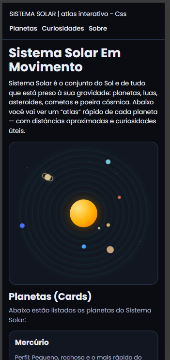

# Sistema Solar — Atlas Interativo (HTML + CSS)

Projeto de front-end **moderno e responsivo** feito com **HTML5 + CSS3**, com animação do Sistema Solar usando **apenas CSS** (órbitas + rotação), cards informativos com scroll interno no desktop e layout adaptado para **mobile/tablet**.

---

## Preview

### Desktop

### Tablet

### Mobile

---

## Funcionalidades

- Layout em 2 colunas (Desktop) com **CSS Grid**
- Responsivo (Tablet/Mobile) com **Media Queries**
- Coluna de cards com **scroll interno** (Desktop) usando `flex` + `min-height: 0`
- Sistema Solar animado com:
  - Sol com gradiente
  - Órbitas e planetas em rotação (`@keyframes`)
  - Brilho suave nas órbitas
  - Fundo com estrelas (pseudo-elemento)
  - Anel de Saturno (pseudo-elemento)
- Acessibilidade: respeita `prefers-reduced-motion`

---

## Tecnologias

- HTML5
- CSS3 (Grid, Flexbox, Keyframes, Media Queries)
- Google Fonts (Poppins)

---

## Como executar

### Opção 1 — Abrindo no navegador
1. Baixe o projeto
2. Abra o arquivo `index.html` no navegador

### Opção 2 — Live Server (recomendado)
No VS Code:
1. Instale a extensão **Live Server**
2. Clique com o botão direito no `index.html`
3. Selecione **Open with Live Server**

---

## Estrutura do projeto
